# labs-database
## 1. Агрегації

### 1.1. Загальна сума транзакцій по кожному користувачу  
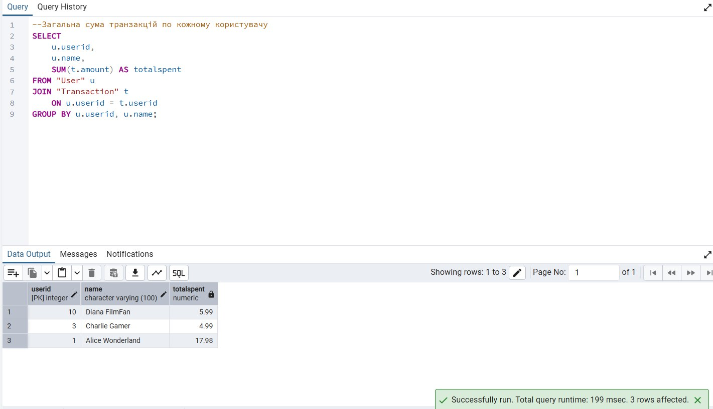

### 1.2. Середня тривалість фільмів по жанрах  
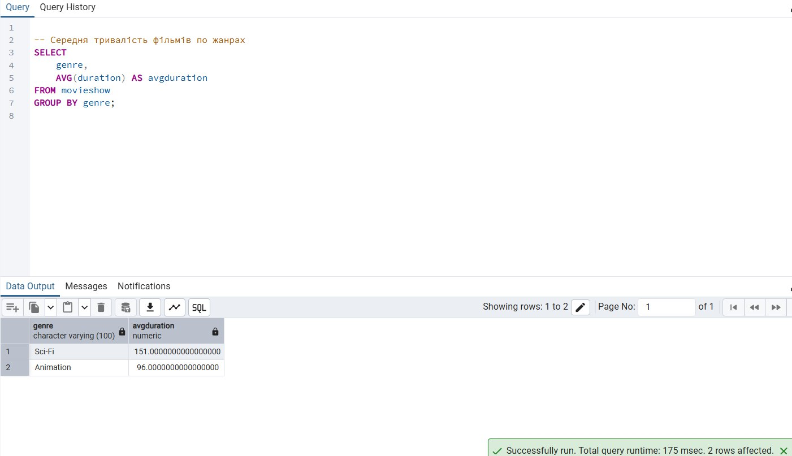

### 1.3. Кількість переглядів кожного фільму  
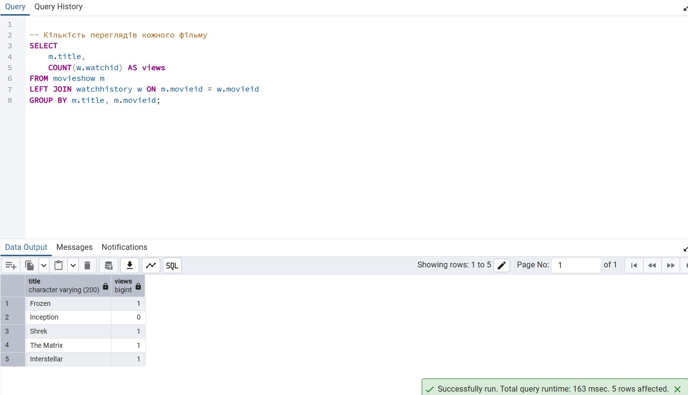

### 1.4. Мінімальна і максимальна сума транзакцій  
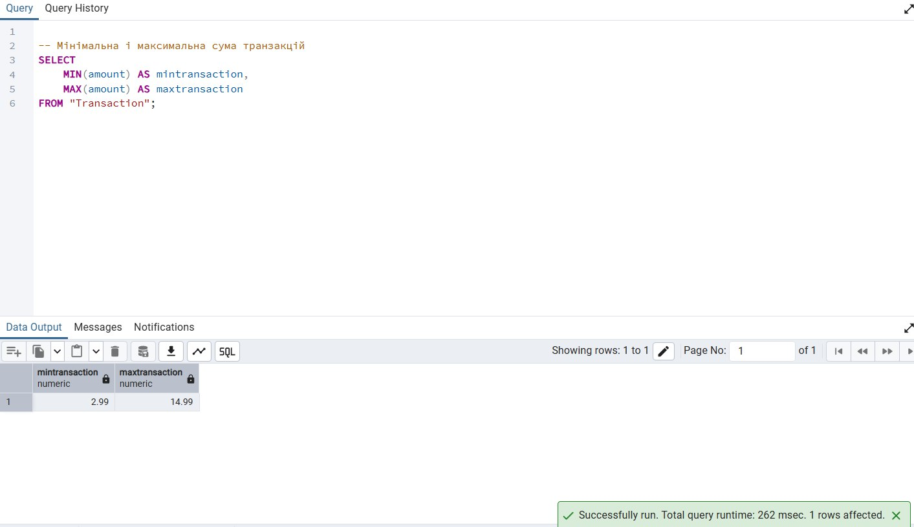

### 1.5. Скільки профілів у кожного користувача  
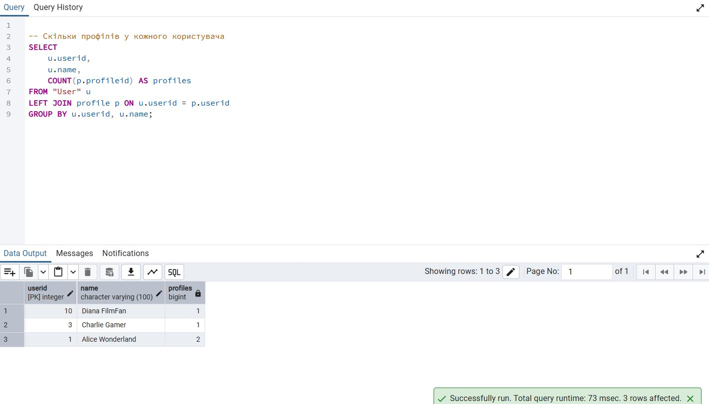

---

## 2. JOIN-и

### 2.1. INNER JOIN — профіль + фільм + перегляд  
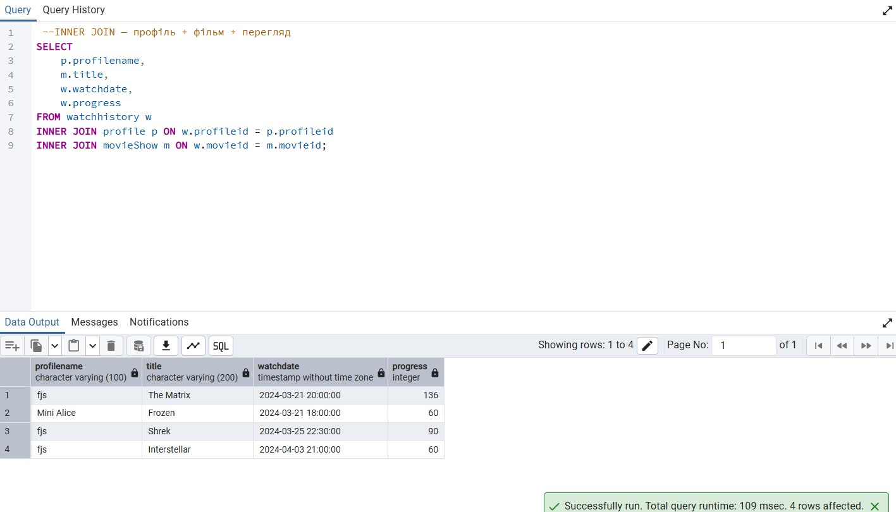

### 2.2. LEFT JOIN — всі юзери + їхні транзакції  
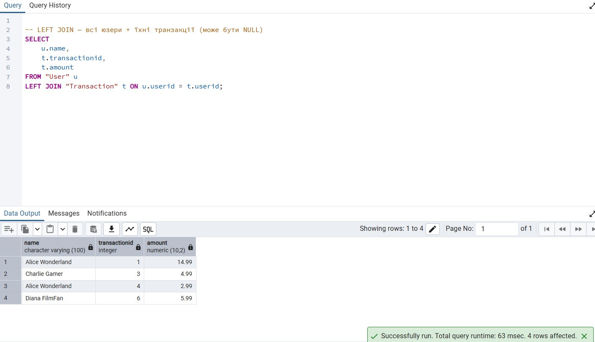

### 2.3. RIGHT JOIN — всі транзакції + відповідні фільми  
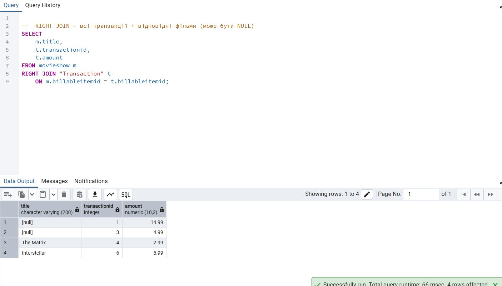

### 2.4. FULL OUTER JOIN  
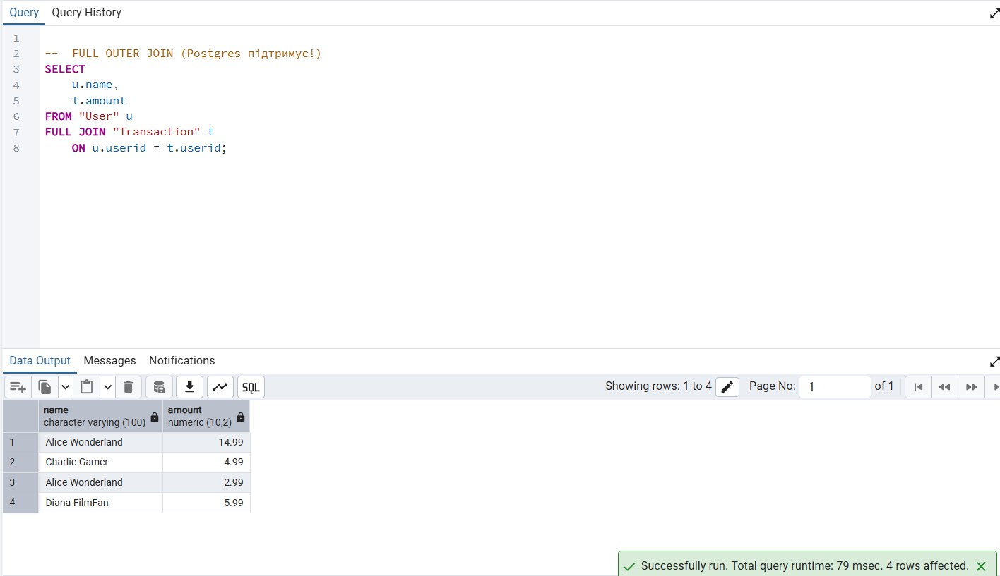

### 2.5. CROSS JOIN — усі комбінації юзерів та жанрів  
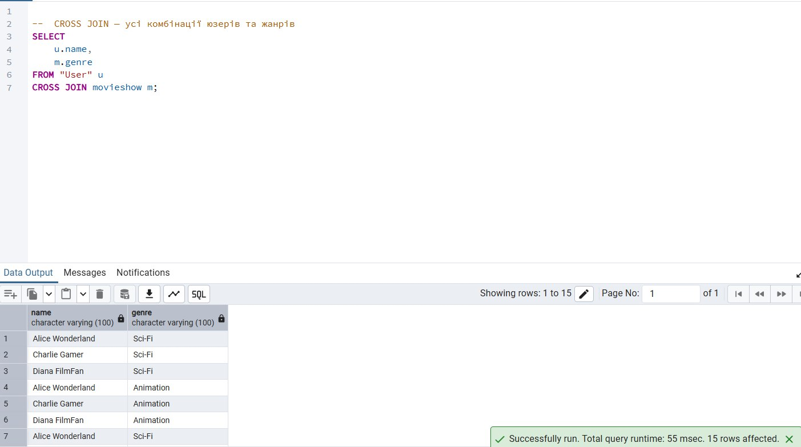

---

## 3. Підзапити

### 3.1. Підзапит у SELECT — скільки юзер витратив всього  
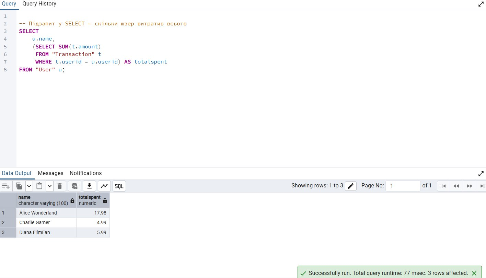

### 3.2. Підзапит у WHERE — знайти юзерів, які витратили більше середнього  
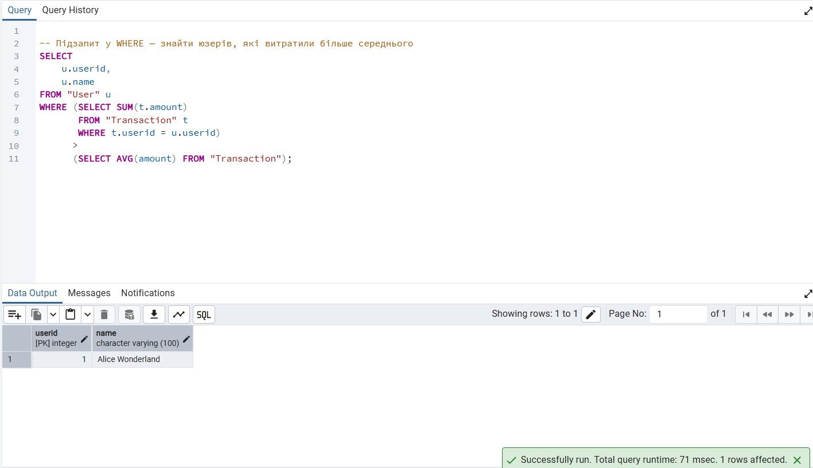

### 3.3. Підзапит у HAVING — жанри, де середня тривалість фільмів більша за загальну середню  
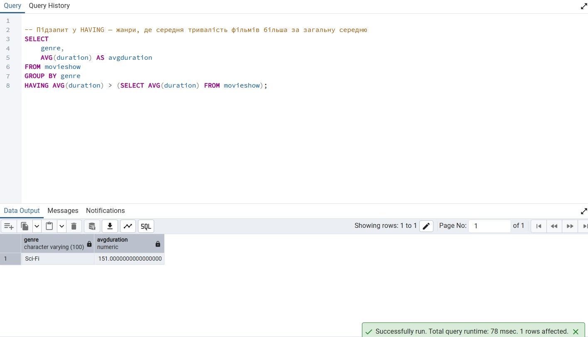
