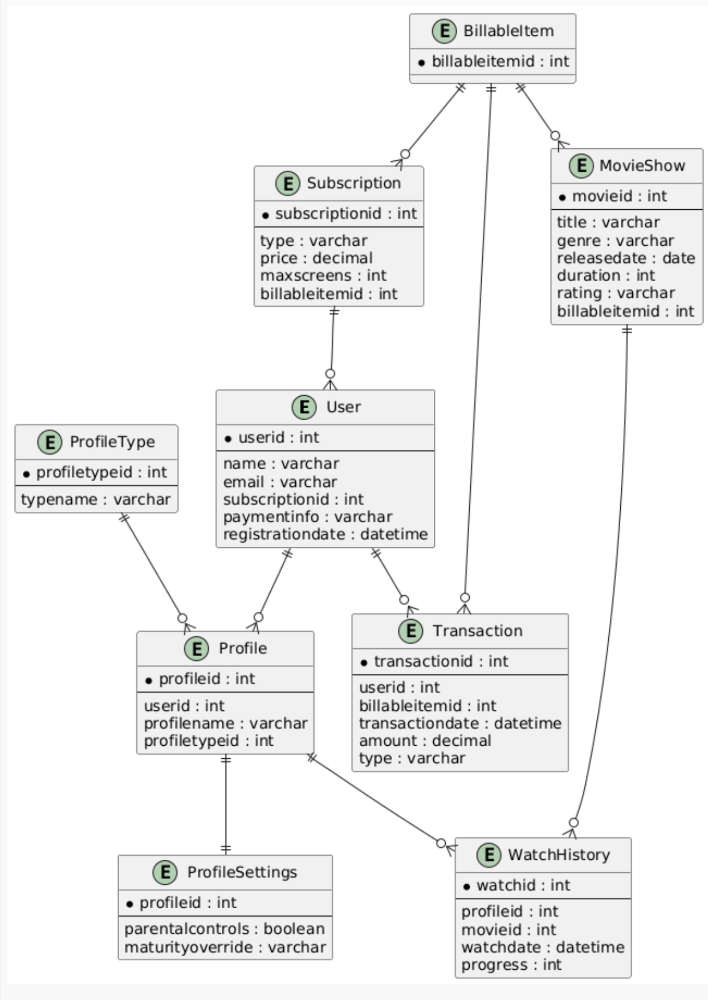

# 🎬 StreamingDB — Нормалізація бази даних (3NF)

Цей репозиторій містить результати нормалізації бази даних **StreamingDB**, яка моделює роботу стрімінгової платформи.  
База приведена до третьої нормальної форми (3NF), усунуто дублювання, транзитивні залежності та неефективну структуру профілів.

---

## ERD (після нормалізації)



---

## 1. Початкова структура бази

Основні таблиці початкової моделі:

- `User`  
- `Profile`  
- `KidProfile`  
- `AdultProfile`  
- `MovieShow`  
- `Subscription`  
- `BillableItem`  
- `Transaction`  
- `WatchHistory`

Проблеми нормалізації виявлені лише в модулі профілів.

---

## 2. Виявлені проблеми

### Порушення 1NF  
Дві таблиці (`KidProfile`, `AdultProfile`) з однаковим первинним ключем `profileid` та різними атрибутами → дублювання структури.

### Порушення 3NF  
Атрибут `agecategory` у таблиці `Profile` визначав, які атрибути належать до профілю:
profileid → agecategory → (parentalcontrols | maturityoverride)


### Зайві NULL значення  
Кожна таблиця містила поля, що працювали лише для частини профілів.

---

## 3. Мета нормалізації

- усунути дублювання даних  
- прибрати транзитивну залежність  
- об’єднати параметри профілю в єдину структуру  
- забезпечити масштабованість та чистоту схеми  
- привести модель до **3NF**

---

## 4. Результат нормалізації

Отримана структура:

User → Profile → ProfileType
↘ ProfileSettings

### ✔ тип профілю винесений у ProfileType  
### ✔ налаштування профілю винесені у ProfileSettings  
### ✔ старі таблиці KidProfile/AdultProfile — видалені  
### ✔ Profile отримав зовнішній ключ на ProfileType  

---

## 5. Опис нових таблиць

### **ProfileType**
Зберігає всі типи профілів.
- profiletypeid (PK)  
- typename (UNIQUE)

### **Profile (оновлено)**
- profileid (PK)  
- userid (FK)  
- profilename  
- profiletypeid (FK → ProfileType)

### **ProfileSettings (нова)**
- profileid (PK, FK → Profile)  
- parentalcontrols (для Kid)  
- maturityoverride (для Adult)

---

## 6. Повний SQL-скрипт нормалізації

```sql
-- STEP 1: Create ProfileType (NEW)
CREATE TABLE IF NOT EXISTS ProfileType (
    profiletypeid SERIAL PRIMARY KEY,
    typename VARCHAR(20) UNIQUE NOT NULL
);

-- Insert types only if they don't exist yet
INSERT INTO ProfileType (typename)
VALUES ('Kid'), ('Adult')
ON CONFLICT (typename) DO NOTHING;

-- STEP 2: Add profiletypeid to Profile (NEW field)
ALTER TABLE profile
    ADD COLUMN IF NOT EXISTS profiletypeid INT;

ALTER TABLE profile
    ADD CONSTRAINT fk_profile_profiletype
        FOREIGN KEY (profiletypeid)
        REFERENCES ProfileType(profiletypeid);

-- STEP 3: Migrate old agecategory to new profiletypeid (if agecategory existed)
-- NOTE: Only run if you had column "agecategory"
UPDATE profile
SET profiletypeid = (SELECT profiletypeid FROM ProfileType WHERE typename = 'Kid')
WHERE agecategory = 'Kid';

UPDATE profile
SET profiletypeid = (SELECT profiletypeid FROM ProfileType WHERE typename = 'Adult')
WHERE agecategory = 'Adult';

-- STEP 4: Create ProfileSettings (NEW)
CREATE TABLE IF NOT EXISTS ProfileSettings (
    profileid INT PRIMARY KEY REFERENCES profile(profileid),
    parentalcontrols BOOLEAN,
    maturityoverride VARCHAR(50)
);

-- STEP 5: Migrate old data from KidProfile
INSERT INTO ProfileSettings (profileid, parentalcontrols)
SELECT profileid, parentalcontrolsenabled
FROM kidprofile
ON CONFLICT (profileid) DO NOTHING;

-- STEP 6: Migrate old data from AdultProfile
INSERT INTO ProfileSettings (profileid, maturityoverride)
SELECT profileid, maturityratingoverride
FROM adultprofile
ON CONFLICT (profileid) DO NOTHING;

-- STEP 7: Drop old columns/tables ONLY after migration
ALTER TABLE profile DROP COLUMN IF EXISTS agecategory;

DROP TABLE IF EXISTS kidprofile;
DROP TABLE IF EXISTS adultprofile;
```

## 7. Переваги нормалізованої структури

- повна відповідність 3NF  
- відсутність дублювання даних  
- один профіль → один тип → один набір налаштувань  
- логічна структура без транзитивних залежностей  
- легке додавання нових типів профілів  
- чистіша та зрозуміліша ER-модель  

---

## 8. Висновок

База даних StreamingDB була успішно нормалізована:  
всі проблеми профілів усунуто, модель стала логічною, масштабованою, узгодженою та відповідає виробничим стандартам.
